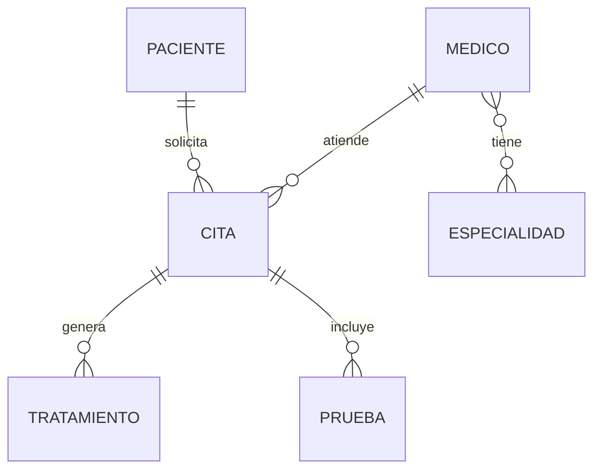

# Clínica Médica – Clinic Management System

Full-stack web application for managing a medical clinic: patients, doctors, specialties, appointments, treatments and diagnostic tests. It combines a Node.js/Express REST API, a MySQL database, JWT authentication and four access levels. It was developed as a practice project (Práctica 3) for the Databases course at Universidad Alfonso X el Sabio (UAX). The user interface, identifiers and database names are in Spanish.

## Features

- **Login with JWT.** Each user has one of four access levels (0 to 3) and is redirected to the page that matches it. Tokens expire after 8 hours.
- **Admin panel (level 0).** Create, read, update and delete operations for doctors, patients, appointments, treatments and tests, create and delete operations for specialties, and a panel to run structural SQL statements (`CREATE`, `ALTER` and `DROP TABLE`).
- **Statistics and rankings (level 1).** Appointments per doctor, appointments by status, doctors with the most patients, most performed tests and patients with the most appointments.
- **Filtered searches (level 2).** Appointments by date range or by status and doctor, treatments by medication, and tests by type and date range.
- **Basic listings (level 3).** Patients, doctors with their specialties, and the appointments of a patient.
- **Scheduled job.** Every minute, pending appointments whose date has already passed are marked as cancelled automatically.
- **Role-based access control.** A middleware checks the token and the access level on every protected route, so permissions are enforced on the server and not only in the interface.

## Tech stack

| Layer | Technologies |
|---|---|
| Backend | Node.js, Express 5, mysql2 (connection pool), jsonwebtoken, node-cron, cors, dotenv, ws |
| Database | MySQL |
| Frontend | HTML, CSS, vanilla JavaScript (`fetch`), Bootstrap 5 |

## Database

The schema has eight tables:

- `Paciente`, `Medico` and `Especialidad` store the main entities. `Medico` also holds the login data and the access level.
- `Medico_Especialidad` is the link table of the many-to-many relationship between doctors and specialties.
- `Cita` stores the appointments. Its status is an `ENUM` (`Pendiente`, `Completada`, `Cancelada`).
- `Tratamiento` and `Prueba` store the treatments and the diagnostic tests of each appointment.
- `Clinica` links a patient, a doctor, an appointment, a treatment and a test. It is documented in the script as being in BCNF.

Foreign keys use `ON DELETE RESTRICT` for patients and doctors, so a patient or doctor with appointments cannot be deleted by accident. Treatments, tests and links use `ON DELETE CASCADE` when their appointment is deleted.



The script `baseDeDatos/BaseDeDatos.sql` creates the database and inserts sample data: five specialties, four doctors, four patients, four appointments, three treatments and three tests.

## Access levels

| Level | Page | Purpose | API write access |
|---|---|---|---|
| 0 | `/admin` | Full administration | Full management of all resources, and structural SQL |
| 1 | `/consultasnivel1` | Statistics and rankings | Create and update patients, appointments, treatments and tests (no delete) |
| 2 | `/consultasnivel2` | Filtered searches | Read only |
| 3 | `/consultasnivel3` | Basic listings | Read only, on a limited set of endpoints |

## REST API

All routes start with `/api`. Only `POST /api/login` is public. The other routes require the header `Authorization: Bearer <token>` and one of the access levels listed below.

| Resource | Read | Create and update | Delete |
|---|---|---|---|
| Doctors `/medicos` | 0, 1, 2 (list) · 0, 1 (by id) | 0 | 0 |
| Patients `/pacientes` | 0, 1, 2 | 0, 1 | 0 |
| Specialties `/especialidades` | 0 to 3 | 0 (create only) | 0 |
| Appointments `/citas` | 0 to 3 (list and by patient) · 0, 1, 2 (by id) | 0, 1 | 0 |
| Treatments `/tratamientos` | 0, 1, 2 | 0, 1 | 0 |
| Tests `/pruebas` | 0, 1, 2 | 0, 1 | 0 |
| Queries `/consultas/...` | Level 1: 0, 1 · Level 2: 0, 1, 2 · Level 3: 0 to 3 | – | – |
| Structure `/estructura` | – | 0 | – |

All queries use placeholders (`?`), so user input is never concatenated into SQL statements.

## Getting started

**Requirements:** Node.js 18 or later and a running MySQL server.

1. Clone the repository and install the dependencies:

   ```
   git clone https://github.com/Gabriel28112005/Clinica-Medica.git
   cd Clinica-Medica
   npm install
   ```

2. Create the database and load the sample data:

   ```
   mysql -u root -p < baseDeDatos/BaseDeDatos.sql
   ```

3. Create a `.env` file in the project root. It is not included in the repository, because it contains private data. Use the variables described in the table below, for example:

   ```
   DB_HOST=localhost
   DB_USER=root
   DB_PASSWORD=your_mysql_password
   DB_NAME=ClinicaMedica
   JWT_SECRET=a_long_random_string
   ```

4. Start the server and open http://localhost:3000:

   ```
   npm start
   ```

### Environment variables

| Variable | Description |
|---|---|
| `DB_HOST` | MySQL host, for example `localhost` |
| `DB_USER` | MySQL user |
| `DB_PASSWORD` | MySQL password |
| `DB_NAME` | Database name (`ClinicaMedica`) |
| `JWT_SECRET` | Secret used to sign the tokens. Use a long random string. |
| `PORT` | Optional. The default is `3000`. |

### Demo accounts

The sample data includes one user per access level. They are meant for local testing only.

| Level | User | Password |
|---|---|---|
| 0 | `admin` | `admin123` |
| 1 | `nivel1` | `nivel1123` |
| 2 | `nivel2` | `nivel2123` |
| 3 | `nivel3` | `nivel3123` |

The pending appointment in the sample data has a date in the past, so the scheduled job cancels it a minute after the server starts.

## Project structure

```
.
├── Server.js                       Express application (static files, routes, WebSocket and jobs)
├── Index.html                      Login page
├── html/                           Admin and query pages for levels 1 to 3
├── assets/
│   ├── css/                        Styles of each page
│   ├── img/                        Images
│   ├── scriptsFrontend/            Vanilla JavaScript: API client, route guards and page logic
│   └── scriptsBackend/
│       ├── Db.js                   MySQL connection pool
│       ├── Jobs.js                 Scheduled job (node-cron)
│       ├── WebSocket.js            WebSocket server (started, but no events are sent yet)
│       ├── autentificacionRoles/   Middleware for JWT and access levels
│       └── rutas/                  REST routes of each resource
└── baseDeDatos/
    └── BaseDeDatos.sql             Schema and sample data
```

## Security notes

This is an academic project, and these points would be addressed before any real deployment:

- Passwords are stored and compared as plain text. A production version would hash them, for example with bcrypt.
- The doctor endpoints return the whole row, including the password field.
- `POST /api/estructura` runs any SQL statement sent by a level 0 user. It exists for the admin panel of structural operations.
- The token is stored in the browser's `localStorage`.
- The project has no automated tests.
